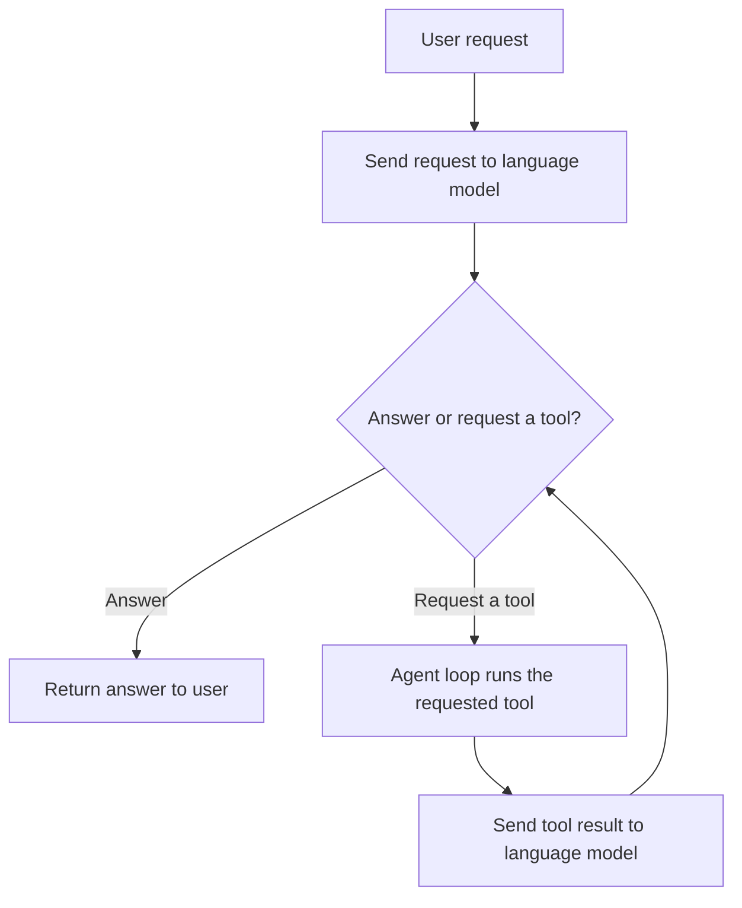
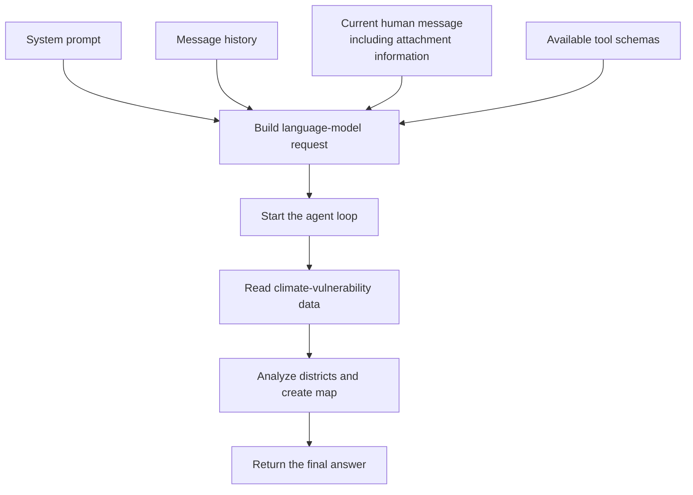
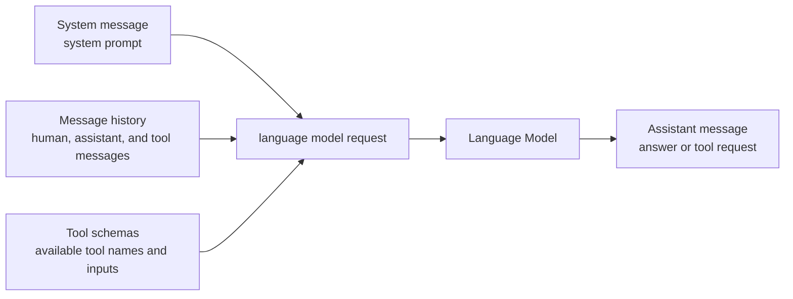
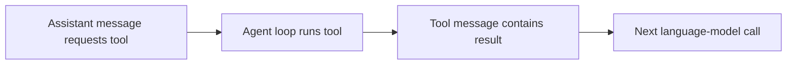
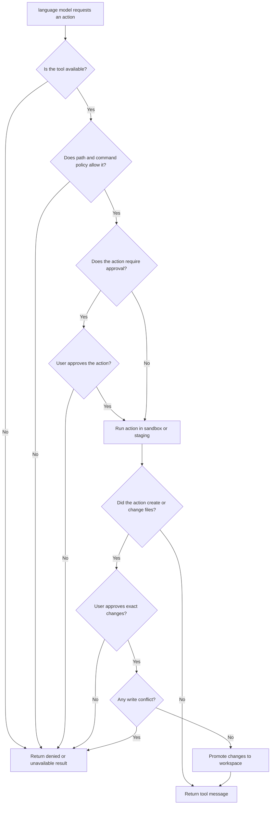
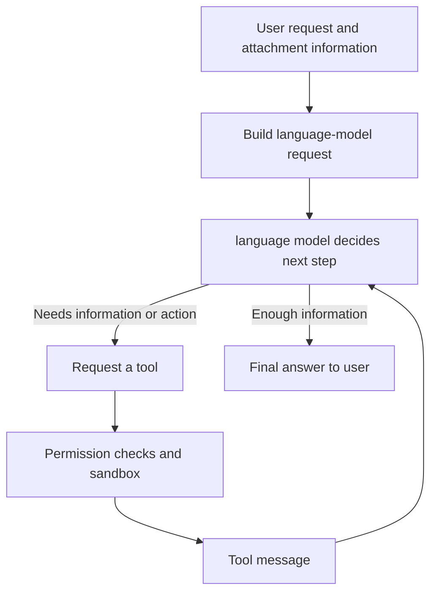

## Brief

Scout is an agentic AI application that helps users explore their files, analyze their own data, answer questions, generate reports and charts, and complete tasks that require running code. This document explains how Scout handles a request, uses agent tools, and controls actions that affect its environment.

The following request is used as an example throughout the document:

> Analyze the climate-vulnerability data, identify the most vulnerable districts, and save a map and summary report.

## 1. From Language Model to Agent

A language model can understand a request and produce a response, but it cannot perform tasks such as opening a file, running code, or saving a chart by itself. Tools provide these missing abilities: they perform tasks on behalf of the language model and allow it to interact with its environment.

Scout coordinates the language model and these tools through the following sequence:

1. Send the user's request to the language model.
2. The language model either answers or requests a tool.
3. If it requests a tool, the agent loop runs that tool.
4. The agent loop sends the tool result back to the language model.
5. Repeat steps 2-4 until the language model answers.

This repeated sequence is the **agent loop**: each tool result informs the language model's next decision. Scout is an **agent** because it combines a language model, tools, and this loop.



## 2. What Happens When a Request Arrives

The climate-vulnerability request requires several actions: read the data, compare vulnerability scores, identify the most vulnerable districts, create a map, and summarize the findings. The agent loop handles these actions one step at a time.

To start the agent loop, Scout sends the language model a request containing:

- The system prompt
- The message history
- The current human message
- The available tool schemas

Attachments become part of the current human message, but different file types are represented differently:

- **Documents and data files:** Scout adds the file path and basic metadata, such as file type, size, page count, or column names. The language model can then request the appropriate tool to read or analyze the file.
- **Images:** Scout includes the image itself as image content in the human message, allowing a supported language model to inspect it directly.



For the climate-vulnerability example, the loop may look like this:

1. An assistant message requests the read tool.
2. The read tool returns the climate-vulnerability data as a tool message.
3. The next assistant message requests an execution tool to compare district scores and generate a map with Python.
4. The execution tool returns the analysis results and generated-map information as another tool message.
5. The language model uses those tool messages to produce the final assistant message.

If the message history becomes too large, Scout summarizes older messages while preserving the system prompt and recent work.

## 3. What the Language Model Receives

LangChain represents the conversation as a sequence of messages. Each message has a type that tells the language model where it came from:

- A **system message** contains the system prompt: Scout's role, rules, workspace information, and guidance for using tools.
- A **human message** contains a user request and its attachment information.
- An **assistant message** contains a language-model response. It may contain a final answer or one or more tool requests.
- A **tool message** contains the result of a requested tool and identifies which tool request it answers.

Together, the human, assistant, and tool messages form the **message history**. Scout sends this history on later calls so the language model can continue from the work already completed.

Tool schemas are supplied alongside these messages. Each schema describes an available tool by its name, purpose, and accepted inputs. For example, a simplified JSON schema for the read tool looks like this:

```json
{
  "name": "read_file",
  "description": "Read a workspace file when its contents are needed to complete the request.",
  "parameters": {
    "path": {
      "type": "string",
      "description": "Path of the file to read"
    }
  }
}
```

The description tells the language model what the tool does and when to use it. The parameters tell it which inputs are required. For the climate-vulnerability request, the language model could request `read_file` with the path of the vulnerability dataset.



### How the Parts Work Together

- The system message explains Scout's behavior and when tools should be used.
- Tool schemas define the exact tools and inputs that the language model can request.
- A tool result becomes a tool message in the message history.
- The next agent-loop call includes that tool message, allowing the language model to use the result.

## 4. Agent Tools

In this document, an **agent tool** means a function described by a tool schema that the language model can request during the agent loop. Application features such as uploading a file are not agent tools because they are performed directly by the interface and server.

The available agent tools fall into several groups:

| Tool group | What it allows the agent to do | Example in the climate-vulnerability request |
|---|---|---|
| File and document tools | List files, read file contents, read PDFs, and search workspace documents. | Read the climate-vulnerability dataset and supporting study. |
| Write tools | Create files, update files, apply patches, and save binary outputs. | Save the summary report and vulnerability map. |
| Execution tools | Run Python, JavaScript, or shell commands and continue long-running commands. | Compare district scores and generate a map with Python. |
| Memory and skill tools | Read stored memory or load request-specific instructions when needed. | Reuse previously stored analysis or reporting preferences. |
| Interaction and permission tools | Ask a blocking question or request additional permission needed for the request. | Request network access if an approved external dependency is required. |

Every agent tool follows the same message flow:



For the climate-vulnerability request, the read tool first returns the dataset as a tool message. After inspecting that message, the language model requests an execution tool to run Python, which returns the district comparison and generated-map information as another tool message.

## 5. Application Features and Safety Controls

Scout also performs work outside the agent loop. These application features support the interface, prepare information for the agent, persist data, and control the effects of agent tools.

### Uploading and Attaching Files

Uploading is an application feature, not an agent tool. The interface sends a file to the server, which saves it in the workspace and marks document search for refresh. Attaching that file to a human message adds its path and metadata so the language model can request an agent tool to read it.

### Tool Access and Permission Checks

Agent tools give the language model indirect access to files, execution, commands, and the network. Before running a requested tool, the permission layer checks whether the tool and requested action are allowed.



| Protection layer | Risk it reduces |
|---|---|
| Available-tool filtering | Prevents the language model from requesting tools it should not have. |
| File-path guard | Checks which files a tool may read or write and blocks protected locations. |
| Command policy | Checks a requested command before it runs and blocks commands that are explicitly disallowed. |
| Action approval | Pauses an action such as network access until the user approves it. |
| Sandbox | Runs code and commands in a restricted environment so they cannot freely access the wider environment. |
| Staging | Stores files created by code or commands in a temporary area before they enter the workspace. |
| Exact-change approval | Shows the specific file changes and applies them only after approval. |
| Conflict detection | Stops a write when the target file changed after the proposed change was prepared. |

Permissions are enforced by the system around the language model. Instructions in a user message or document cannot bypass these checks.

## 6. Complete Flow

The complete flow combines the agent loop with the permission checks applied before a tool runs:



The language model chooses each step, tools perform requested actions, and permission checks control which actions are allowed.

## 7. Technology Stack

Scout uses a Python backend for the agent and server, with TypeScript interfaces for terminal, browser, and desktop use.

| Area | Technology | Responsibility |
|---|---|---|
| Agent flow | **LangGraph** | Defines the agent loop and routes between language-model calls, tool execution, and the final response. |
| Language-model and tool interfaces | **LangChain** | Provides message types, tool definitions, and the interface used to attach tools to language-model requests. |
| Model providers | **LiteLLM** and **LangChain LiteLLM** | Connect Scout to different hosted or local language-model providers through a common interface. |
| Agent tools and backend logic | **Python** | Implements file operations, document reading, search, permissions, execution, memory, and the agent itself. |
| API server | **FastAPI** | Receives chat requests, handles uploads and approvals, manages sessions, and streams agent events to the interfaces. |
| Document search | **BM25**, `rank-bm25`, and LangChain text splitters | Splits workspace documents into searchable sections and retrieves sections that match a query. |
| Terminal interface | **TypeScript**, **React**, and **Ink** | Renders the interactive command-line interface using React components inside the terminal. |
| Browser interface | **TypeScript**, **React**, **Vite**, and **Tailwind CSS** | Builds the web interface used to chat with Scout and inspect its output. |
| Desktop application | **Electron** | Packages the browser interface and local Scout server as a desktop application. |
| Persistent records | **SQLite** and **JSONL files** | Store records such as memories, execution audits, users, and conversation sessions. |
| Isolated execution | **Python execution services**, operating-system sandboxing, and Docker support | Run generated code and shell commands with restricted file and network access. |

### Where to Look in the Repository

- `python/src/scout/agent/` contains the agent loop, prompts, message handling, and tools.
- `python/src/scout/execution/` contains code execution, command policies, sandboxing, staging, and approvals.
- `python/src/scout/server/` contains the FastAPI server, sessions, uploads, authentication, and streamed chat API.
- `packages/gui/` contains the browser interface.
- `packages/gui-app/` contains the Electron desktop application.
- `packages/cli/` contains the React and Ink terminal interface.
- `packages/core/` contains shared TypeScript code used by the interfaces to run and communicate with the Python server.
